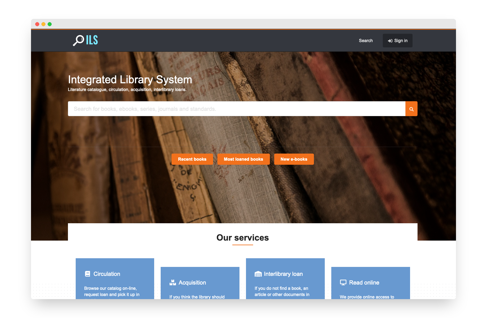

# Preview

At this moment, the easiest way to preview InvenioILS is to install Docker in your machine and simply run docker-compose to start all the needed services.

If you want to develop or make changes on InvenioILS, you will have instead to follow the [development installation guide](customize/develop.md).

## Prerequisites

For both previewing or developing InvenioILS, you will need GIT and Docker. See the related documentations on how to install [GIT](https://git-scm.com/), [Docker](https://docs.docker.com/get-docker/) and [docker-compose](https://docs.docker.com/compose/install/) in your computer.

After the installation, open a terminal and make sure that you GIT and Docker are available in your path (we recommend the latest software versions but it is not required). For example:

```shell
$ git --version
git version 2.29.2

$ docker --version
Docker version 20.10.0, build 7287ab3

$ docker-compose --version
docker-compose version 1.27.4, build 40524192
```

Now, clone the project repository from GitHub <https://github.com/inveniosoftware/invenio-app-ils>:

```shell
cd <my directory e.g. myprojects>/invenioils
git clone https://github.com/inveniosoftware/invenio-app-ils invenioils
cd invenioils
```

## Run

Make sure that you have completed the steps above. Then, in a new terminal, run docker-compose:

```shell
docker-compose -f docker-compose.full.yml up
```

!!! warning
    Make sure you have [enough virtual memory](https://www.elastic.co/guide/en/elasticsearch/reference/current/docker.html#docker-compose-file) for Elasticsearch in Docker.

!!! note
    When you start the Docker services for the first time, the process will take some time. This is because Docker will build the InvenioILS images.

    From the second time, starting the Docker services will take only a few seconds.

Now generate the demo data. This step has to been done *only the first time* or if the Docker containers have been destroyed. In a new terminal, run a shell inside the Invenio container and execute the `setup` script:

```shell
docker exec -it invenio-app-ils_backend_1 /bin/bash
invenio@e34cadf4b303:/opt/invenio_app_ils/src$ ./scripts/setup
```

InvenioILS should be now running. Open your browser at the address https://127.0.0.1/ and accept self-signed certificate warning.



## Demo users

You can find the list of demo users in the homepage of InvenioILS when you run it (scroll down). Otherwise, here the list:

| user      | email             | psw    | notes                                                  |
| --------- | ----------------- | ------ | ------------------------------------------------------ |
| admin     | admin@test.ch     | 123456 | super admin user, can access also to /admin            |
| librarian | librarian@test.ch | 123456 | user with "librarian" rights, can access to backoffice |
| patron1   | patron1@test.ch   | 123456 | a patron user, cannot access to backoffice             |
| patron2   | patron2@test.ch   | 123456 | a patron user, cannot access to backoffice             |
| patron3   | patron3@test.ch   | 123456 | a patron user, cannot access to backoffice             |
| patron4   | patron4@test.ch   | 123456 | a patron user, cannot access to backoffice             |
